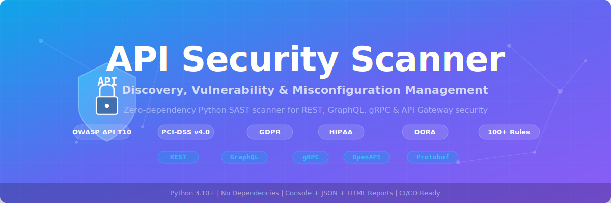

<p align="center">
  
</p>

# API Security Scanner

An open-source, zero-dependency Python-based **API Security Scanner** that performs comprehensive static analysis to discover, audit, and report API security vulnerabilities and misconfigurations across **REST, GraphQL, gRPC, OpenAPI specs, and API gateway configurations** — mapped to the **OWASP API Security Top 10 (2023)**.

**No external dependencies required** — runs on pure Python 3.10+ stdlib on Windows, macOS, and Linux.

---

## Why API Security?

Traditional application scanners miss API-specific threats. This scanner fills the gap by detecting:

- **Broken Object Level Authorisation (BOLA)** — direct ID references without ownership checks, sequential IDs
- **Broken Authentication** — hardcoded JWT secrets, weak algorithms, disabled verification, API keys in URLs
- **Mass Assignment** — request body unpacked directly into models, excessive data exposure
- **Unrestricted Resource Consumption** — missing rate limiting, no pagination, unbounded uploads
- **Broken Function Level Authorisation** — admin endpoints without role checks, privilege escalation
- **Sensitive Business Flow Abuse** — no CAPTCHA on login, unprotected payment flows
- **Server-Side Request Forgery (SSRF)** — user-controlled URLs in server requests, webhook abuse
- **Security Misconfiguration** — CORS wildcard, debug mode, verbose errors, TLS issues
- **Improper Inventory Management** — shadow APIs, deprecated endpoints, exposed documentation
- **Unsafe API Consumption** — unvalidated third-party responses, no timeouts or circuit breakers
- **Injection** — SQL, NoSQL, command injection, XXE, path traversal, LDAP injection
- **Secrets Exposure** — hardcoded API keys, passwords, private keys, database connection strings
- **GraphQL Risks** — introspection enabled, no depth limiting, batching attacks, missing auth on mutations
- **gRPC Risks** — insecure channels, reflection enabled, unlimited message size
- **API Gateway Misconfigs** — Nginx, Kong, Envoy, AWS API Gateway without rate limiting or auth

---

## Features

- **100+ security rules** across 22 categories
- **5 compliance frameworks** — OWASP API Top 10, PCI-DSS v4.0, GDPR, HIPAA, DORA
- **API Inventory Discovery** — auto-detects frameworks, protocols, auth methods, gateways, databases
- **Multi-protocol** — REST, GraphQL, gRPC, OpenAPI/Swagger, Protobuf
- **Multi-language** — Python, JavaScript/TypeScript, Java, Go, Ruby, PHP
- **Gateway config scanning** — Nginx, Kong, Envoy, AWS API Gateway
- **K8s API security** — Ingress TLS, LoadBalancer restrictions, NetworkPolicy, secrets mounting
- **3 output formats** — coloured console, JSON, interactive HTML
- **Exit codes** — returns `1` if CRITICAL or HIGH findings, `0` otherwise (CI/CD friendly)
- **Single file** — entire scanner is one portable Python file with no pip installs needed

---

## Security Check Groups (100+ Rules)

| # | Category | Rule IDs | OWASP | Key Checks |
|---|----------|----------|-------|------------|
| 1 | **BOLA** | API1-001 to 006 | API1 | Direct object ID access, path param without auth, sequential IDs |
| 2 | **Broken Authentication** | API2-001 to 010 | API2 | Missing auth decorator, JWT hardcoded/weak/unverified, API key in URL, CSRF disabled, OAuth implicit |
| 3 | **Property Level Auth** | API3-001 to 005 | API3 | Mass assignment, excessive data exposure, sensitive fields in response, GraphQL field exposure |
| 4 | **Resource Consumption** | API4-001 to 006 | API4 | No rate limiting, no pagination, unbounded uploads, no timeout, GraphQL depth/complexity |
| 5 | **BFLA** | API5-001 to 004 | API5 | Admin endpoints without RBAC, privilege escalation, method override, unprotected DELETE |
| 6 | **Business Flow** | API6-001 to 003 | API6 | No CAPTCHA on login, unprotected payment/checkout, password reset abuse |
| 7 | **SSRF** | API7-001 to 004 | API7 | User URL in server request, open redirect, webhook SSRF, file import SSRF |
| 8 | **Misconfiguration** | API8-001 to 010 | API8 | CORS wildcard, debug mode, verbose errors, missing headers, HTTP serving, TLS verify disabled |
| 9 | **Inventory Management** | API9-001 to 004 | API9 | Multiple versions, exposed Swagger/docs, deprecated endpoints, debug endpoints |
| 10 | **Unsafe Consumption** | API10-001 to 004 | API10 | Unvalidated responses, no timeout, no circuit breaker, blind redirect following |
| 11 | **Input Validation** | API-INJ-001 to 007 | — | SQL injection, NoSQL injection, command injection, XSS, LDAP injection, XXE, path traversal |
| 12 | **Secrets** | API-SEC-001 to 006 | — | Hardcoded API keys, passwords, private keys, AWS creds, DB connection strings, bearer tokens |
| 13 | **Transport / TLS** | API-TLS-001 to 004 | — | HTTP endpoints, weak TLS versions, weak ciphers, missing HSTS |
| 14 | **Logging** | API-LOG-001 to 003 | — | Sensitive data in logs, disabled logging, full request body logged |
| 15 | **GraphQL** | API-GQL-001 to 005 | — | Introspection, no depth limit, batching, unauthenticated mutations, missing field auth |
| 16 | **gRPC** | API-GRPC-001 to 004 | — | Insecure channel, reflection, no auth interceptor, unlimited message size |
| 17 | **API Gateway** | API-GW-001 to 005 | — | Nginx/Kong/Envoy/AWS without rate limiting or auth |
| 18 | **Environment Secrets** | API-ENV-001 to 006 | — | API keys, DB passwords, JWT secrets, OAuth secrets, debug mode in .env |
| 19 | **Container Security** | API-DOCKER-001 to 004 | — | Root user, secrets in Dockerfile, unversioned base, HTTP port exposed |
| 20 | **K8s API Security** | API-K8S-001 to 005 | — | Ingress without TLS, LoadBalancer open, no NetworkPolicy, no limits, secret as env var |
| 21 | **OpenAPI Spec** | API-SPEC-001 to 005 | — | No security scheme, API key in query, missing response schema, HTTP server URL |
| 22 | **Protobuf** | API-PROTO-001 to 002 | — | Sensitive fields without annotation, RPC without auth |

---

## Compliance Frameworks

Every finding is mapped to applicable compliance frameworks:

| Framework | Scope |
|-----------|-------|
| **OWASP API Top 10 (2023)** | API1 through API10 — industry standard for API security |
| **PCI-DSS v4.0** | Payment card data protection |
| **GDPR** | EU data privacy regulation |
| **HIPAA** | Healthcare data protection |
| **DORA** | Digital operational resilience (financial sector) |

---

## Prerequisites

- **Python 3.10 or later** — check with `python --version` or `python3 --version`
- **No pip installs needed** — only Python standard library

---

## Installation

### Option 1: Clone the Repository

```bash
git clone https://github.com/Krishcalin/API-Security.git
cd API-Security
```

### Option 2: Download the Scanner File

```bash
curl -O https://raw.githubusercontent.com/Krishcalin/API-Security/main/api_security_scanner.py
```

### Verify It Works

```bash
python api_security_scanner.py --version
# Output: API Security Scanner v1.0.0
```

---

## Quick Start

### 1. Scan Your API Project

```bash
# Scan an entire project directory
python api_security_scanner.py /path/to/your/api-project

# Scan a single file
python api_security_scanner.py /path/to/your/app.py
```

### 2. Generate Reports

```bash
# JSON report (machine-parseable, for CI/CD)
python api_security_scanner.py ./my-api --json report.json

# HTML report (interactive, for stakeholders)
python api_security_scanner.py ./my-api --html report.html

# Both reports at once
python api_security_scanner.py ./my-api --json report.json --html report.html
```

### 3. Filter by Severity

```bash
# Only CRITICAL and HIGH
python api_security_scanner.py ./my-api --severity HIGH

# Only CRITICAL
python api_security_scanner.py ./my-api --severity CRITICAL
```

### 4. Verbose Mode

```bash
python api_security_scanner.py ./my-api --verbose
```

---

## Usage

### CLI Reference

```
usage: api_security_scanner.py [-h] [--json FILE] [--html FILE]
                                [--severity {CRITICAL,HIGH,MEDIUM,LOW,INFO}]
                                [-v] [--version]
                                target

positional arguments:
  target                File or directory to scan

options:
  -h, --help            Show help message and exit
  --json FILE           Save JSON report to FILE
  --html FILE           Save HTML report to FILE
  --severity SEV        Minimum severity (CRITICAL, HIGH, MEDIUM, LOW, INFO)
  -v, --verbose         Show files being scanned
  --version             Show scanner version
```

### Examples

```bash
# Scan current directory
python api_security_scanner.py .

# Scan a Flask/FastAPI app
python api_security_scanner.py src/api/

# Scan an OpenAPI spec
python api_security_scanner.py openapi.yaml

# Scan a GraphQL schema
python api_security_scanner.py schema.graphql

# Scan a protobuf service definition
python api_security_scanner.py service.proto

# Scan Nginx API gateway config
python api_security_scanner.py nginx.conf

# Scan .env for exposed API secrets
python api_security_scanner.py .env

# Scan K8s API deployment
python api_security_scanner.py k8s/api-deploy.yaml

# Full scan with all outputs
python api_security_scanner.py ./my-api --json report.json --html report.html --severity MEDIUM --verbose
```

---

## File Types Scanned

| File Type | Extensions / Names | What Is Checked |
|-----------|-------------------|-----------------|
| **Python** | `.py`, `.pyw` | All OWASP API T10 rules + injection + secrets + logging (Flask, FastAPI, Django) |
| **JavaScript / TypeScript** | `.js`, `.jsx`, `.ts`, `.tsx`, `.mjs`, `.cjs` | Same rules (Express, NestJS, Koa) |
| **Java / Go / Ruby / PHP** | `.java`, `.go`, `.rb`, `.php` | All source code rules (Spring, Gin, Rails, Laravel) |
| **GraphQL schemas** | `.graphql`, `.gql` | 5 GraphQL-specific rules + BOLA + property auth |
| **Protobuf** | `.proto` | 2 Protobuf rules + gRPC security |
| **OpenAPI / Swagger** | `.yaml`, `.yml`, `.json` | 5 OpenAPI spec rules (auto-detected by content) |
| **Nginx / Gateway configs** | `nginx.conf`, `*.conf` | 5 gateway rules + misconfiguration + TLS |
| **Environment files** | `.env`, `.env.*` | 6 rules for API keys, DB passwords, JWT secrets, debug mode |
| **Dockerfiles** | `Dockerfile`, `*.dockerfile` | 4 rules for container security |
| **K8s manifests** | `.yaml`, `.yml` | 5 K8s API rules (Ingress TLS, LoadBalancer, NetworkPolicy) |

---

## API Inventory Discovery

The scanner automatically discovers and reports API components in your codebase:

| Category | Detected Items |
|----------|----------------|
| **Frameworks** | Flask, FastAPI, Django, Express, NestJS, Koa, Hapi, Spring Boot, Gin, Echo, Fiber, Actix, Rails, Laravel, Phoenix, Graphene, Strawberry, Apollo, Ariadne, Nexus |
| **Protocols** | REST, GraphQL, gRPC, SOAP, WebSocket, SSE, Protobuf, OpenAPI, Swagger |
| **Auth Methods** | JWT, OAuth2, Basic Auth, API Key, Bearer Token, SAML, mTLS, OpenID Connect, Passport.js, Auth0, Cognito, Keycloak |
| **API Gateways** | Nginx, Kong, Envoy, Traefik, Apigee, AWS API Gateway, Azure APIM, Istio |
| **Databases** | PostgreSQL, MySQL, MongoDB, Redis, Elasticsearch, DynamoDB, SQLite, Cassandra, Neo4j |

---

## CI/CD Integration

The scanner returns exit code `1` if CRITICAL or HIGH findings are present:

### GitHub Actions

```yaml
name: API Security Scan
on: [push, pull_request]

jobs:
  api-security:
    runs-on: ubuntu-latest
    steps:
      - uses: actions/checkout@v4
      - uses: actions/setup-python@v5
        with:
          python-version: '3.12'
      - name: Run API Security Scanner
        run: python api_security_scanner.py . --severity HIGH --json report.json --html report.html
      - name: Upload Report
        if: always()
        uses: actions/upload-artifact@v4
        with:
          name: api-security-report
          path: |
            report.json
            report.html
```

### GitLab CI

```yaml
api-security-scan:
  stage: test
  image: python:3.12-slim
  script:
    - python api_security_scanner.py . --severity HIGH --json report.json --html report.html
  artifacts:
    paths: [report.json, report.html]
    when: always
```

---

## Testing with Sample Files

```bash
# Run against all test samples (expects 190+ findings)
python api_security_scanner.py tests/samples/ --verbose

# Generate full report
python api_security_scanner.py tests/samples/ --html test-report.html --json test-report.json
```

### Test Sample Files

| File | Purpose | Expected Findings |
|------|---------|-------------------|
| `vulnerable_api.py` | Insecure Flask API (BOLA, auth, SSRF, injection, secrets) | 100+ |
| `vulnerable_api.js` | Insecure Express.js API | 40+ |
| `vulnerable_openapi.yaml` | Insecure OpenAPI 3.x spec | 10+ |
| `vulnerable_api.graphql` | Insecure GraphQL schema | 5+ |
| `vulnerable_api.proto` | Insecure gRPC protobuf | 10+ |
| `.env.api` | Exposed API secrets and debug mode | 15+ |
| `Dockerfile.api` | Insecure API container | 5+ |
| `nginx_api.conf` | Insecure Nginx API proxy | 5+ |
| `k8s_api_deploy.yaml` | Insecure K8s API deployment | 5+ |

---

## Project Structure

```
API-Security/
├── api_security_scanner.py    # Main scanner (single file, no dependencies)
├── banner.svg                 # Project banner
├── CLAUDE.md                  # Claude Code project instructions
├── LICENSE                    # MIT License
├── README.md                  # This file
├── .gitignore                 # Python gitignore
└── tests/
    └── samples/               # Intentionally vulnerable test files
        ├── vulnerable_api.py
        ├── vulnerable_api.js
        ├── vulnerable_openapi.yaml
        ├── vulnerable_api.graphql
        ├── vulnerable_api.proto
        ├── .env.api
        ├── Dockerfile.api
        ├── nginx_api.conf
        └── k8s_api_deploy.yaml
```

---

## Contributing

1. Add a rule dict to the appropriate `*_RULES` list in `api_security_scanner.py`
2. Follow the ID pattern: `API{N}-{NNN}` (OWASP) or `API-{CATEGORY}-{NNN}`
3. Every rule must include: `id`, `category`, `severity`, `name`, `pattern`, `description`, `cwe`, `recommendation`, `compliance`
4. Add a test case to `tests/samples/` that triggers the new rule
5. Run `python api_security_scanner.py tests/samples/ --verbose` to verify

---

## License

This project is licensed under the MIT License — see the [LICENSE](LICENSE) file for details.
